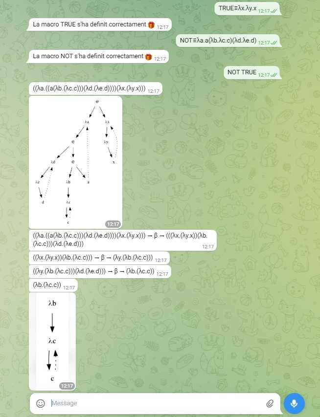

# Intèrpret de λ-càlcul AChurch

Pràctica de LP del curs 2022-2023 Q2. És un bot de telegram que avalua expressions en λ-càlcul.

## Requeriments
- Python > 3.10
- antlr4-tools
    ```shell
    pip install antlr4-tools
    ```
- antlr4-python3-runtime = 4.7
    ```shell
    pip install antlr4-python3-runtime==4.7
    ```
- python-telegram-bot
    ```shell
    pip install python-telegram-bot
    ```
- pydot & graphviz
    ```shell
    pip install pydot graphviz
    ```
- Telegram

## Generant els fitxers amb antlr
Per crear tots els fitxers necessaris, desde dins del directori, executa:
```shell
antlr4 -Dlanguage=Python3 -no-listener -visitor lc.g4
```
Això genera els fitxers `lc.interp`, `lc.tokens`, `lcLexer.interp`, `lcLexer.py`, `lcLexer.tokens`, `lcParser.py` i `lcVisitor.py`, necessaris per poder executar l'intèrpret.


## Enllaçant l'intèrpret amb el bot de telegram
Si no has creat un bot de telegram, segueix [aquestes instruccions](https://core.telegram.org/bots/features#creating-a-new-bot) per fer-ho (Envia `/newbot` a [@BotFather](https://t.me/botfather) i segueix els passos).


Això t'hauria de proporcionar un `token`, que hauras de copiar dins d'un nou fitxer a la mateixa carpeta anomenat `token.txt`. Si no tens aquest token, segueix aquesta [guia](https://core.telegram.org/bots/features#generating-an-authentication-token) per crear-ne un de nou.

## Execució
Finalment, executa:
```shell
python3 achurch.py
```
Enhorabona, ja pots enviar comandes al bot desde telegram.

---
---

## Guia ràpida
L'intèrpret té diferents funcionalitats:
- `/start`: Et dona la benvinguda
- `/author`: Et dona informació sobre l'autor
- `/help`: Mostra aquesta llista
- `/macros`: Mostra un llistat de totes les macros definides
- Definició d'una macro nova:  
    `MACRO≡expressió`

    El simbol igual pot ser = o ≡.
    - Macro amb notació prefixa: 

        `MACRO` ha de començar amb una Lletra majúscula i contenir només lletres majúscules, minúscules o números. Per exemple 
        >TRUE≡λx.λy.x
    - Macro amb notació infixa:

        `MACRO` ha de un conjunt dels següents símbols: `/ ^ | $ % & # ' ? ¿ ~ · @ ! " ¬ - + * [ ] { } \`. Per exemple:
        >+≡λp.λq.λx.λy.(px(qxy))
- Avaluació d'una expressió: Si envies una expressió en λ-càlcul (que pot estar formada per macros), et respondrà primer amb l'arbre de sintaxi abstracte de la expressió original i l'avaluarà, ensenyant-te també l'ABS del resultat i tots els passos intermitjos que faci. Per definir una lambda es pot utilitzar tant `λ` com `\`. Per exemple:
    >(λyx.y)x

## Exemple




## Autor
Pere Carrillo
